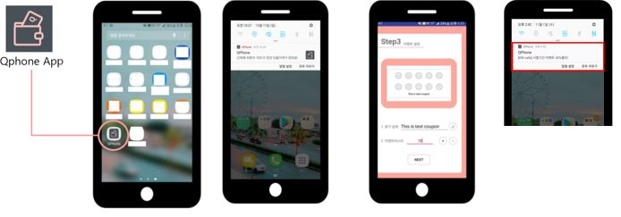
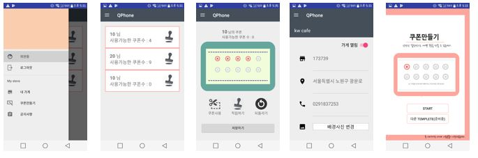
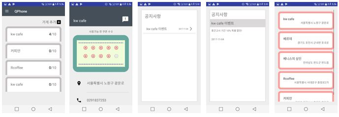

# QPhone

- Provides coupon application tool that enables small business owners and customers to conveniently create and manage mobile coupons.

## Functions

#### * For Small Businessmen

1. Members: List members by using rssi strength and mac number (in order to distinguish the target consumers) -> List coupons to earn coupons
2. My shop: You can check the store information and the unique number used in the app,
3. Create Coupon: You can create your own coupon
4. Real time notification using firebase API when registering announcement.

#### * For Members

1. Home - You can see a list of stores you have registered and the number of coupons available.
2. You can check the store's customized coupons and information by clicking on the store.
3. If you press the "!" Label, a list will be displayed for confirming the announcement, and you can check the announcement.
4. If you click the Add Store label, you can browse and register the stores that are currently registered in the database.

### Require
- Android sdk version 5.2, My SQL, Java Server Page, Tomcat 8.0, github, jdk8.0, firebase API
